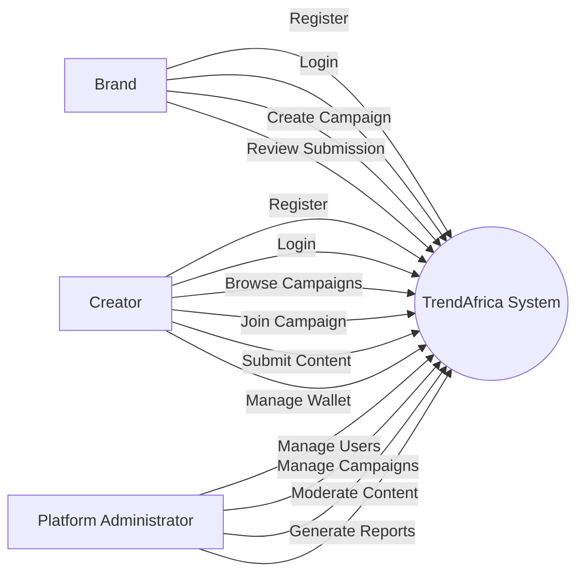
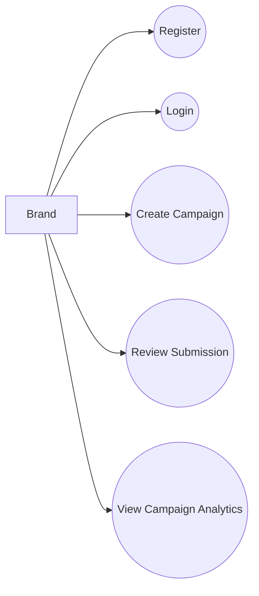
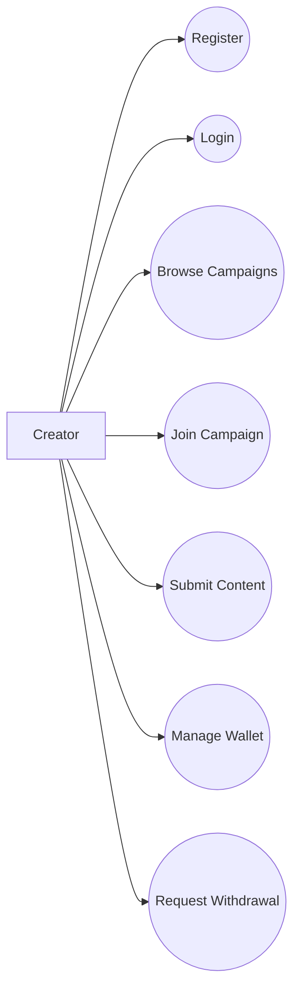
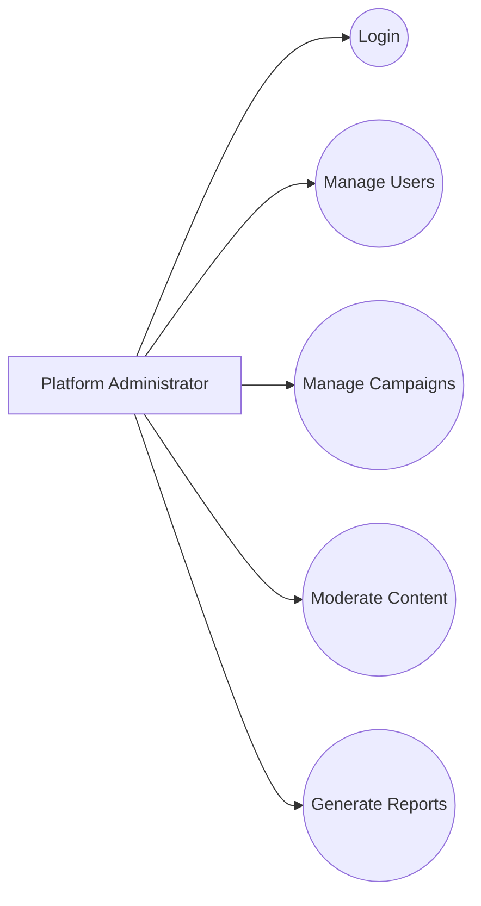

# TrendAfrica Use Case Diagrams
## 1. Overall System Use Case Diagram

```mermaid
flowchart LR
    Brand[Brand]
    Creator[Creator]
    Admin[Platform Administrator]

    System((TrendAfrica System))

    Brand -->|Register| System
    Brand -->|Login| System
    Brand -->|Create Campaign| System
    Brand -->|Review Submission| System

    Creator -->|Register| System
    Creator -->|Login| System
    Creator -->|Browse Campaigns| System
    Creator -->|Join Campaign| System
    Creator -->|Submit Content| System
    Creator -->|Manage Wallet| System

    Admin -->|Manage Users| System
    Admin -->|Manage Campaigns| System
    Admin -->|Moderate Content| System
    Admin -->|Generate Reports| System
```

## 2. Brand Use Case Diagram

```mermaid
flowchart LR
    Brand[Brand]

    Register((Register))
    Login((Login))
    CreateCampaign((Create Campaign))
    ReviewSubmission((Review Submission))
    ViewAnalytics((View Campaign Analytics))

    Brand --> Register
    Brand --> Login
    Brand --> CreateCampaign
    Brand --> ReviewSubmission
    Brand --> ViewAnalytics
```
## 3. Creator Use Case Diagram

```mermaid
flowchart LR
    Creator[Creator]

    Register((Register))
    Login((Login))
    BrowseCampaigns((Browse Campaigns))
    JoinCampaign((Join Campaign))
    SubmitContent((Submit Content))
    Wallet((Manage Wallet))
    Withdraw((Request Withdrawal))

    Creator --> Register
    Creator --> Login
    Creator --> BrowseCampaigns
    Creator --> JoinCampaign
    Creator --> SubmitContent
    Creator --> Wallet
    Creator --> Withdraw
```

## 4. Platform Administrator Use Case Diagram

```mermaid
flowchart LR
    Admin[Platform Administrator]

    Login((Login))
    ManageUsers((Manage Users))
    ManageCampaigns((Manage Campaigns))
    ModerateContent((Moderate Content))
    GenerateReports((Generate Reports))

    Admin --> Login
    Admin --> ManageUsers
    Admin --> ManageCampaigns
    Admin --> ModerateContent
    Admin --> GenerateReports
```