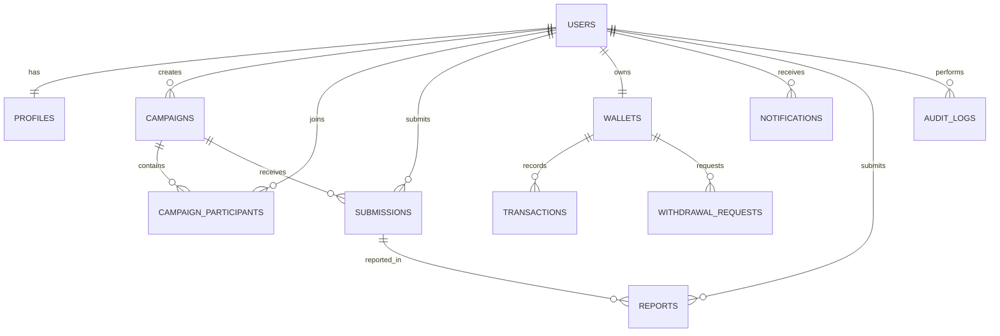

# TrendAfrica Database Design
## 1. Database Overview

### Purpose

The TrendAfrica database stores and manages all data required for the platform, including users, campaigns, submissions, wallets, transactions, and administrative activities.

The database is designed to ensure:

- Data integrity
- High performance
- Security
- Scalability
- Maintainability

---

### Database Management System

TrendAfrica will use:

**PostgreSQL**

Reasons:

- Open source
- Highly reliable
- Excellent performance
- ACID compliant
- Supports complex relationships
- Excellent support for indexing and scalability

---

### Design Principles

The database will follow these principles:

- Third Normal Form (3NF)
- Referential Integrity
- Minimal Data Redundancy
- Strong Data Validation
- Secure Storage of Sensitive Data
- Optimized Query Performance
- Scalable Structure

## 2. Core Database Entities

The TrendAfrica MVP will include the following core entities:

### 1. Users

Stores account information for Brands, Creators, and Platform Administrators.

---

### 2. Profiles

Stores additional profile information based on the user's role.

---

### 3. Campaigns

Stores marketing campaigns created by brands.

---

### 4. Campaign Participants

Stores records of creators who join campaigns.

---

### 5. Submissions

Stores campaign content submitted by creators.

---

### 6. Wallets

Stores each creator's wallet balance.

---

### 7. Transactions

Stores earnings and payment history.

---

### 8. Withdrawal Requests

Stores creator withdrawal requests.

---

### 9. Reports

Stores reports submitted against users or content.

---

### 10. Notifications

Stores notifications sent to users.

---

### 11. Audit Logs

Stores administrative actions performed within the system.
## 3. Database Table: Users

### Purpose

Stores authentication and basic account information for all users of the TrendAfrica platform.

---

### Table Name

users

---

### Columns

| Column | Data Type | Constraints | Description |
|---------|-----------|-------------|-------------|
| id | UUID | Primary Key | Unique user identifier |
| first_name | VARCHAR(100) | NOT NULL | User's first name |
| last_name | VARCHAR(100) | NOT NULL | User's last name |
| email | VARCHAR(255) | UNIQUE, NOT NULL | User's email address |
| password_hash | VARCHAR(255) | NOT NULL | Encrypted password |
| role | VARCHAR(20) | NOT NULL | Brand, Creator, or Admin |
| email_verified | BOOLEAN | DEFAULT FALSE | Email verification status |
| account_status | VARCHAR(20) | DEFAULT 'ACTIVE' | Current account status |
| created_at | TIMESTAMP | NOT NULL | Account creation date |
| updated_at | TIMESTAMP | NOT NULL | Last account update |

---

### Primary Key

- id

---

### Unique Constraints

- email

---

### Relationships

- One User can own many Campaigns.
- One User can join many Campaigns.
- One User can have one Wallet.
- One User can have many Notifications.
- One User can submit many Submissions.

---

### Indexes

- email
- role
- account_status

## 4. Database Table: Profiles

### Purpose

Stores additional profile information for users based on their role.

---

### Table Name

profiles

---

### Columns

| Column | Data Type | Constraints | Description |
|---------|-----------|-------------|-------------|
| id | UUID | Primary Key | Unique profile identifier |
| user_id | UUID | Foreign Key, UNIQUE, NOT NULL | References users.id |
| profile_photo | VARCHAR(500) | NULL | URL to profile image |
| phone_number | VARCHAR(20) | NULL | User's phone number |
| country | VARCHAR(100) | NULL | Country of residence |
| city | VARCHAR(100) | NULL | City of residence |
| bio | TEXT | NULL | User biography |
| company_name | VARCHAR(255) | NULL | Brand company name |
| website | VARCHAR(255) | NULL | Company or personal website |
| social_media_links | JSONB | NULL | Social media profiles |
| created_at | TIMESTAMP | NOT NULL | Profile creation date |
| updated_at | TIMESTAMP | NOT NULL | Last profile update |

---

### Primary Key

- id

---

### Foreign Key

- user_id → users.id

---

### Relationships

- One User has one Profile.
- One Profile belongs to one User.

---

### Indexes

- user_id
- country
- city

## 5. Database Table: Campaigns

### Purpose

Stores marketing campaigns created by brands for creators to participate in.

---

### Table Name

campaigns

---

### Columns

| Column | Data Type | Constraints | Description |
|---------|-----------|-------------|-------------|
| id | UUID | Primary Key | Unique campaign identifier |
| brand_id | UUID | Foreign Key, NOT NULL | References users.id (Brand) |
| title | VARCHAR(255) | NOT NULL | Campaign title |
| description | TEXT | NOT NULL | Campaign description |
| campaign_type | VARCHAR(50) | NOT NULL | Type of campaign (Video, Image, Blog, etc.) |
| budget | DECIMAL(12,2) | NOT NULL | Total campaign budget |
| reward_per_creator | DECIMAL(12,2) | NOT NULL | Reward paid to each approved creator |
| max_creators | INTEGER | NOT NULL | Maximum number of creators allowed |
| start_date | DATE | NOT NULL | Campaign start date |
| end_date | DATE | NOT NULL | Campaign end date |
| status | VARCHAR(20) | DEFAULT 'DRAFT' | Draft, Active, Completed, Suspended |
| requirements | TEXT | NULL | Campaign requirements |
| created_at | TIMESTAMP | NOT NULL | Campaign creation date |
| updated_at | TIMESTAMP | NOT NULL | Last campaign update |

---

### Primary Key

- id

---

### Foreign Key

- brand_id → users.id

---

### Relationships

- One Brand can create many Campaigns.
- One Campaign can have many Participants.
- One Campaign can have many Submissions.

---

### Indexes

- brand_id
- status
- start_date
- end_date

## 6. Database Table: Campaign Participants

### Purpose

Stores records of creators who have joined campaigns.

---

### Table Name

campaign_participants

---

### Columns

| Column | Data Type | Constraints | Description |
|---------|-----------|-------------|-------------|
| id | UUID | Primary Key | Unique participation record |
| campaign_id | UUID | Foreign Key, NOT NULL | References campaigns.id |
| creator_id | UUID | Foreign Key, NOT NULL | References users.id (Creator) |
| joined_at | TIMESTAMP | NOT NULL | Date and time the creator joined the campaign |
| status | VARCHAR(20) | DEFAULT 'ACTIVE' | Active, Completed, Withdrawn |
| created_at | TIMESTAMP | NOT NULL | Record creation date |
| updated_at | TIMESTAMP | NOT NULL | Last record update |

---

### Primary Key

- id

---

### Foreign Keys

- campaign_id → campaigns.id
- creator_id → users.id

---

### Unique Constraint

- (campaign_id, creator_id)

A creator can only join the same campaign once.

---

### Relationships

- One Campaign can have many Participants.
- One Creator can participate in many Campaigns.

---

### Indexes

- campaign_id
- creator_id
- status

## 7. Database Table: Submissions

### Purpose

Stores campaign content submitted by creators for review by brands.

---

### Table Name

submissions

---

### Columns

| Column | Data Type | Constraints | Description |
|---------|-----------|-------------|-------------|
| id | UUID | Primary Key | Unique submission identifier |
| campaign_id | UUID | Foreign Key, NOT NULL | References campaigns.id |
| creator_id | UUID | Foreign Key, NOT NULL | References users.id (Creator) |
| submission_url | VARCHAR(500) | NOT NULL | Cloudinary URL of the uploaded content |
| submission_type | VARCHAR(20) | NOT NULL | Video, Image, Document |
| notes | TEXT | NULL | Creator's additional notes |
| status | VARCHAR(20) | DEFAULT 'PENDING' | Pending, Approved, Rejected |
| feedback | TEXT | NULL | Brand feedback for the submission |
| reviewed_by | UUID | Foreign Key, NULL | References users.id (Brand) |
| reviewed_at | TIMESTAMP | NULL | Date and time of review |
| submitted_at | TIMESTAMP | NOT NULL | Submission date and time |
| created_at | TIMESTAMP | NOT NULL | Record creation date |
| updated_at | TIMESTAMP | NOT NULL | Last record update |

---

### Primary Key

- id

---

### Foreign Keys

- campaign_id → campaigns.id
- creator_id → users.id
- reviewed_by → users.id

---

### Relationships

- One Campaign can have many Submissions.
- One Creator can have many Submissions.
- One Brand can review many Submissions.

---

### Indexes

- campaign_id
- creator_id
- status
- reviewed_by

## 8. Database Table: Wallets

### Purpose

Stores the wallet balance for each creator.

---

### Table Name

wallets

---

### Columns

| Column | Data Type | Constraints | Description |
|---------|-----------|-------------|-------------|
| id | UUID | Primary Key | Unique wallet identifier |
| user_id | UUID | Foreign Key, UNIQUE, NOT NULL | References users.id (Creator) |
| available_balance | DECIMAL(12,2) | DEFAULT 0.00 | Amount available for withdrawal |
| pending_balance | DECIMAL(12,2) | DEFAULT 0.00 | Earnings awaiting approval |
| total_earned | DECIMAL(12,2) | DEFAULT 0.00 | Total earnings since account creation |
| currency | VARCHAR(10) | DEFAULT 'NGN' | Wallet currency |
| created_at | TIMESTAMP | NOT NULL | Wallet creation date |
| updated_at | TIMESTAMP | NOT NULL | Last wallet update |

---

### Primary Key

- id

---

### Foreign Key

- user_id → users.id

---

### Unique Constraint

- user_id

Each creator can have only one wallet.

---

### Relationships

- One User has one Wallet.
- One Wallet can have many Transactions.
- One Wallet can have many Withdrawal Requests.

---

### Indexes

- user_id
- currency

## 9. Database Table: Transactions

### Purpose

Stores all financial transactions related to creator wallets.

---

### Table Name

transactions

---

### Columns

| Column | Data Type | Constraints | Description |
|---------|-----------|-------------|-------------|
| id | UUID | Primary Key | Unique transaction identifier |
| wallet_id | UUID | Foreign Key, NOT NULL | References wallets.id |
| transaction_type | VARCHAR(30) | NOT NULL | Earning, Withdrawal, Refund, Adjustment, Bonus |
| amount | DECIMAL(12,2) | NOT NULL | Transaction amount |
| currency | VARCHAR(10) | DEFAULT 'NGN' | Transaction currency |
| status | VARCHAR(20) | DEFAULT 'COMPLETED' | Pending, Completed, Failed, Cancelled |
| reference | VARCHAR(100) | UNIQUE | External or internal transaction reference |
| description | TEXT | NULL | Additional transaction details |
| created_at | TIMESTAMP | NOT NULL | Transaction creation date |

---

### Primary Key

- id

---

### Foreign Key

- wallet_id → wallets.id

---

### Relationships

- One Wallet can have many Transactions.

---

### Indexes

- wallet_id
- transaction_type
- status
- reference
- created_at

## 10. Database Table: Withdrawal Requests

### Purpose

Stores withdrawal requests submitted by creators before payment processing.

---

### Table Name

withdrawal_requests

---

### Columns

| Column | Data Type | Constraints | Description |
|---------|-----------|-------------|-------------|
| id | UUID | Primary Key | Unique withdrawal request identifier |
| wallet_id | UUID | Foreign Key, NOT NULL | References wallets.id |
| amount | DECIMAL(12,2) | NOT NULL | Amount requested for withdrawal |
| currency | VARCHAR(10) | DEFAULT 'NGN' | Withdrawal currency |
| payment_method | VARCHAR(50) | NOT NULL | Bank Transfer, Mobile Money, etc. |
| account_details | JSONB | NOT NULL | Payment destination details |
| status | VARCHAR(20) | DEFAULT 'PENDING' | Pending, Approved, Rejected, Paid |
| reviewed_by | UUID | Foreign Key, NULL | References users.id (Administrator) |
| review_notes | TEXT | NULL | Administrator comments |
| requested_at | TIMESTAMP | NOT NULL | Date and time the request was submitted |
| processed_at | TIMESTAMP | NULL | Date and time the request was processed |
| created_at | TIMESTAMP | NOT NULL | Record creation date |
| updated_at | TIMESTAMP | NOT NULL | Last record update |

---

### Primary Key

- id

---

### Foreign Keys

- wallet_id → wallets.id
- reviewed_by → users.id

---

### Relationships

- One Wallet can have many Withdrawal Requests.
- One Administrator can review many Withdrawal Requests.

---

### Indexes

- wallet_id
- status
- requested_at
- reviewed_by

## 11. Database Table: Notifications

### Purpose

Stores in-app notifications sent to users.

---

### Table Name

notifications

---

### Columns

| Column | Data Type | Constraints | Description |
|---------|-----------|-------------|-------------|
| id | UUID | Primary Key | Unique notification identifier |
| user_id | UUID | Foreign Key, NOT NULL | References users.id |
| title | VARCHAR(255) | NOT NULL | Notification title |
| message | TEXT | NOT NULL | Notification content |
| notification_type | VARCHAR(50) | NOT NULL | Campaign, Submission, Withdrawal, System, Payment |
| is_read | BOOLEAN | DEFAULT FALSE | Indicates whether the notification has been read |
| created_at | TIMESTAMP | NOT NULL | Notification creation date |
| read_at | TIMESTAMP | NULL | Date and time the notification was read |

---

### Primary Key

- id

---

### Foreign Key

- user_id → users.id

---

### Relationships

- One User can receive many Notifications.

---

### Indexes

- user_id
- notification_type
- is_read
- created_at

## 12. Database Table: Reports

### Purpose

Stores reports submitted by users against content or other users for administrator review.

---

### Table Name

reports

---

### Columns

| Column | Data Type | Constraints | Description |
|---------|-----------|-------------|-------------|
| id | UUID | Primary Key | Unique report identifier |
| reporter_id | UUID | Foreign Key, NOT NULL | References users.id |
| reported_user_id | UUID | Foreign Key, NULL | References users.id |
| submission_id | UUID | Foreign Key, NULL | References submissions.id |
| report_type | VARCHAR(50) | NOT NULL | Spam, Abuse, Copyright, Fraud, Other |
| reason | TEXT | NOT NULL | Detailed reason for the report |
| status | VARCHAR(20) | DEFAULT 'OPEN' | Open, Under Review, Resolved, Rejected |
| reviewed_by | UUID | Foreign Key, NULL | References users.id (Administrator) |
| resolution_notes | TEXT | NULL | Administrator's findings or decision |
| created_at | TIMESTAMP | NOT NULL | Report creation date |
| resolved_at | TIMESTAMP | NULL | Date the report was resolved |

---

### Primary Key

- id

---

### Foreign Keys

- reporter_id → users.id
- reported_user_id → users.id
- submission_id → submissions.id
- reviewed_by → users.id

---

### Relationships

- One User can submit many Reports.
- One User can be reported many times.
- One Submission can have many Reports.
- One Administrator can review many Reports.

---

### Indexes

- reporter_id
- reported_user_id
- submission_id
- status
- report_type

## 13. Database Table: Audit Logs

### Purpose

Stores a history of important administrative actions performed within the TrendAfrica platform.

---

### Table Name

audit_logs

---

### Columns

| Column | Data Type | Constraints | Description |
|---------|-----------|-------------|-------------|
| id | UUID | Primary Key | Unique audit log identifier |
| admin_id | UUID | Foreign Key, NOT NULL | References users.id (Administrator) |
| action | VARCHAR(100) | NOT NULL | Action performed (e.g., Suspend User, Approve Withdrawal) |
| entity_type | VARCHAR(50) | NOT NULL | Type of entity affected (User, Campaign, Submission, Report, Withdrawal) |
| entity_id | UUID | NOT NULL | Identifier of the affected record |
| details | JSONB | NULL | Additional information about the action |
| ip_address | VARCHAR(45) | NULL | IP address of the administrator |
| user_agent | TEXT | NULL | Browser or client information |
| created_at | TIMESTAMP | NOT NULL | Date and time the action occurred |

---

### Primary Key

- id

---

### Foreign Key

- admin_id → users.id

---

### Relationships

- One Administrator can create many Audit Log records.

---

### Indexes

- admin_id
- action
- entity_type
- entity_id
- created_at

## 14. Entity Relationship Diagram (ERD)

